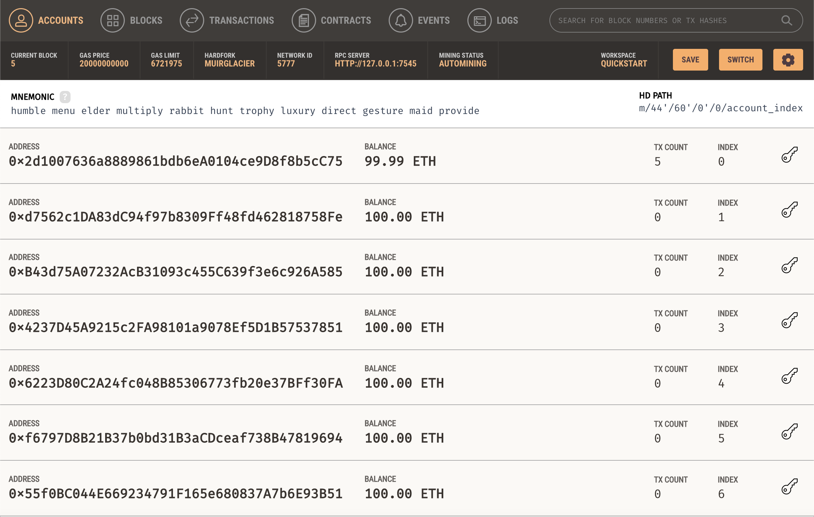
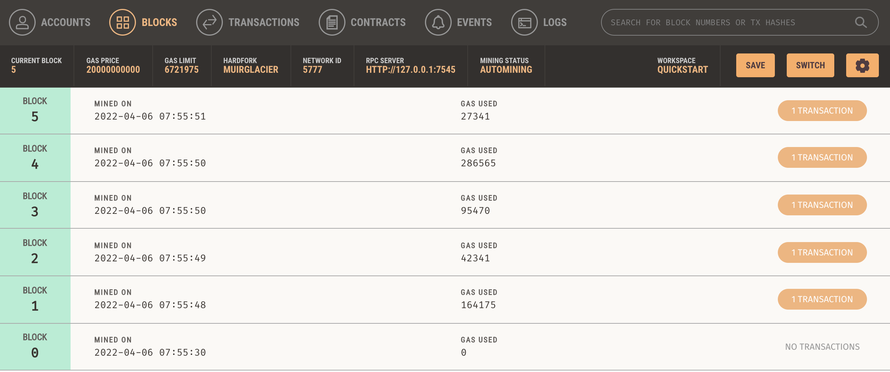

# MetaCoin
MetaCoin is truffle boxes project

## document
- [truffle quick start sample](https://trufflesuite.com/docs/truffle/quickstart.html)
- [metacoin ezample in truffle](https://trufflesuite.com/boxes/metacoin/)
- [ganache](https://trufflesuite.com/ganache/) 

## set up
- install truffle
  - `npm install -g truffle`
- creating a project
  - `mkdir MetaCoin`
  - `cd MetaCoin`
- download metacoin boxes
  - `truffle unbox metacoin`

## test
- run solidity test
  - `truffle test ./test/TestMetaCoin.sol`
- run javascript test
  - `truffle test ./test/metacoin.js`

## compile
- compile
  - `truffle compile`

## install ganache
- download and install
  - visit [ganache web site](https://trufflesuite.com/ganache/) and click download(macos) button

## edit truffle-config.js
- replace the content with the following
- ```
  module.exports = {
    networks: {
      development: {
        host: "127.0.0.1",
        port: 7545,
        network_id: "*"
      }
    }
  };
  ```

## launch ganache
- click ganache in your applications

## deploy contract
- on terminal run below command
  - `truffle migrate`

## check ganache
- you can check your local block chain like this
  - accounts
    - 
  - blocks
    - 
  - transactions
    - 